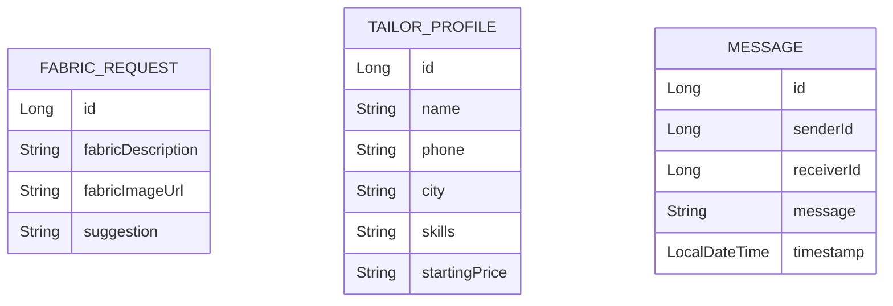

<!-- ===================== KapdaCraft README ===================== -->

<p align="center">
  <!-- Animated Banner (capsule-render) -->
  
</p>

<p align="center">
  <b>👗 Fabric Style Advisor + Tailor Chat Platform</b><br/>
  A Spring Boot + PostgreSQL based mini startup prototype 🚀
</p>

<p align="center">
  
  
  
  
</p>

<p align="center">
  
  
  
</p>

---

## 📌 Table of Contents
- [🌟 About](#-about)
- [✨ Features](#-features)
- [🗄️ ER Diagram](#️-er-diagram)
- [🏗️ Project Architecture](#️-project-architecture)
- [🛠️ Tech Stack](#️-tech-stack)
- [⚙️ How To Run](#️-how-to-run)
- [🧪 API Endpoints](#-api-endpoints)
- [📦 Sample JSON](#-sample-json)
- [🚀 Future Improvements](#-future-improvements)
- [👨‍💻 Developer](#-developer)

---

## 🌟 About
**KapdaCraft** is a smart fabric styling and tailor connection platform where:

✅ Users can get outfit suggestions based on fabric  
✅ Suggestions are saved in history  
✅ Tailors (Aunties 👵) can be searched by city  
✅ Users can chat with tailors (WhatsApp-style UI)  
✅ Fabric meter calculator based on height  
✅ Fabric image preview supported  

Built using **Spring Boot 3 + JPA/Hibernate + PostgreSQL + HTML/Bootstrap**.

---

## ✨ Features

### 👗 Fabric Suggestion
- Input fabric description
- Get outfit suggestion (Lehenga / Suit / Sharara / Indo-western)
- Auto-saved in database

### 🖼 Fabric Image Preview
- Optional image URL
- Preview shown in history

### 📜 Suggestion History
- All previous requests stored
- Displayed with image preview

### 👵 Tailor Listing
- Add tailor via API
- Search tailors by city

### 💬 Chat System
- Send message
- Fetch full conversation
- WhatsApp style UI bubbles
- Auto-scroll enabled

### 📏 Meter Calculator
- Enter outfit type
- Enter height (cm)
- Get required fabric meters

---

## 🗄️ ER Diagram


    🏗️ Project Architecture
KapdaCraft
 ├── controller
 ├── service
 ├── repository
 ├── model
 ├── static              # frontend (index.html, css, js)
 └── application.properties
🛠️ Tech Stack
Layer	Technology
Backend	Spring Boot 3
Database	PostgreSQL
ORM	Hibernate / JPA
Frontend	HTML + Bootstrap
Build Tool	Maven
⚙️ How To Run
1️⃣ Create Database
CREATE DATABASE kapdacraft;
2️⃣ Update application.properties
spring.datasource.url=jdbc:postgresql://localhost:5432/kapdacraft
spring.datasource.username=postgres
spring.datasource.password=yourpassword

spring.jpa.hibernate.ddl-auto=update
spring.jpa.show-sql=true
3️⃣ Run Spring Boot

In Eclipse / IntelliJ:
▶ Run KapdaCraftApplication.java

4️⃣ Open in Browser
http://localhost:8080/index.html
🧪 API Endpoints
👗 Fabric
Method	Endpoint	Description
POST	/fabric/ask	Get suggestion
GET	/fabric/history	Get all history
👵 Tailor
Method	Endpoint	Description
POST	/tailors	Add tailor
GET	/tailors	Get all tailors
GET	/tailors/city/{city}	Search by city
💬 Chat
Method	Endpoint	Description
POST	/chat/send	Send message
GET	/chat/conversation?sender=1&receiver=2	Get full chat
📏 Meter Calculator
Method	Endpoint
POST	/meter/calculate

Example Body

{
  "outfitType": "lehenga",
  "heightCm": "170"
}
📦 Sample JSON
✅ Sample Tailor JSON
{
  "name": "Aunty Simi",
  "phone": "9876543210",
  "city": "Phagwara",
  "skills": "Lehenga,Suit,Sharara",
  "startingPrice": "700"
}
📸 Demo Preview

Fabric Suggestion + Chat + Tailor Search UI
(You can add screenshots/gifs here later)

🚀 Future Improvements

🔐 Login & Role Based Security

📸 Real Image Upload (Multipart)

⭐ Tailor Rating System

📍 Location-based Tailor Search

💳 Online Booking System

🌐 Deploy on Render / Railway

👨‍💻 Developer

Amandeep Kumar
Java Backend Developer 💻 | Spring Boot Enthusiast 🚀

<p align="center"> Made with ❤️ using Spring Boot </p> ```
