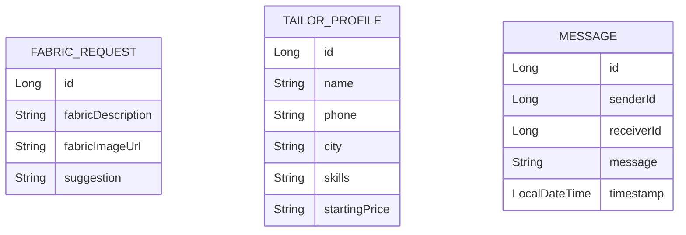

<h1 align="center">👗 KapdaCraft</h1>

<p align="center">
  <b>Fabric Style Advisor + Tailor Chat Platform</b><br>
  A Spring Boot + PostgreSQL based mini startup prototype 🚀
</p>

<p align="center">
  
  
  
  
</p>
## 🗄️ ER Diagram


---

## 🌟 About Project

KapdaCraft is a smart fabric styling and tailor connection platform where:

✔ Users can get outfit suggestions based on fabric  
✔ Suggestions are saved in history  
✔ Tailors (Aunties 👵) can be searched by city  
✔ Users can chat with tailors  
✔ Fabric meter calculator based on height  
✔ Fabric image preview supported  

This project is built using **Spring Boot + JPA + PostgreSQL**.

---

## 🏗️ Project Architecture

```
KapdaCraft
 ├── controller
 ├── service
 ├── repository
 ├── model
 ├── static (frontend)
 └── application.properties
```

---

## 🔥 Features

### 👗 Fabric Suggestion
- Input fabric description
- Get outfit suggestion (Lehenga / Suit / Sharara / Indo-western)
- Auto saved in database

### 🖼 Fabric Image Preview
- Optional image URL
- Preview shown in history

### 📜 Suggestion History
- All previous requests stored
- Displayed with image preview

### 👵 Tailor Listing
- Add tailor via API
- Search tailors by city

### 💬 Chat System
- Send message
- Fetch full conversation
- WhatsApp style UI bubbles
- Auto-scroll enabled

### 📏 Meter Calculator
- Enter outfit type
- Enter height (cm)
- Get required fabric meters

---

## 🛠️ Tech Stack

| Layer        | Technology |
|-------------|------------|
| Backend     | Spring Boot 3 |
| Database    | PostgreSQL |
| ORM         | Hibernate / JPA |
| Frontend    | HTML + Bootstrap |
| Build Tool  | Maven |

---

## ⚙️ How To Run

### 1️⃣ Create Database

```sql
CREATE DATABASE kapdacraft;
```

---

### 2️⃣ Update application.properties

```
spring.datasource.url=jdbc:postgresql://localhost:5432/kapdacraft
spring.datasource.username=postgres
spring.datasource.password=yourpassword

spring.jpa.hibernate.ddl-auto=update
```

---

### 3️⃣ Run Spring Boot

In Eclipse / IntelliJ:

▶ Run `KapdaCraftApplication.java`

---

### 4️⃣ Open Browser

```
http://localhost:8080/index.html
```

---

## 🧪 API Endpoints

### 📌 Fabric

| Method | Endpoint | Description |
|--------|----------|------------|
| POST | `/fabric/ask` | Get suggestion |
| GET | `/fabric/history` | Get all history |

---

### 📌 Tailor

| Method | Endpoint | Description |
|--------|----------|------------|
| POST | `/tailors` | Add tailor |
| GET | `/tailors` | Get all tailors |
| GET | `/tailors/city/{city}` | Search by city |

---

### 📌 Chat

| Method | Endpoint | Description |
|--------|----------|------------|
| POST | `/chat/send` | Send message |
| GET | `/chat/conversation?sender=1&receiver=2` | Get full chat |

---

### 📌 Meter Calculator

| Method | Endpoint |
|--------|----------|
| POST | `/meter/calculate` |

Example Body:

```json
{
  "outfitType": "lehenga",
  "heightCm": "170"
}
```

---

## 💡 Sample Tailor JSON

```json
{
  "name": "Aunty Simi",
  "phone": "9876543210",
  "city": "Phagwara",
  "skills": "Lehenga,Suit,Sharara",
  "startingPrice": "700"
}
```

---

## 🚀 Future Improvements

- 🔐 Login & Role Based Security
- 📸 Real Image Upload (Multipart)
- ⭐ Tailor Rating System
- 📍 Location-based Tailor Search
- 💳 Online Booking System
- 🌐 Deploy on Render / Railway

---

## 📸 Demo Preview

> Fabric Suggestion + Chat + Tailor Search UI

---

## 👨‍💻 Developer

**Amandeep Kumar**  
Java Backend Developer 💻  
Spring Boot Enthusiast 🚀  

---

<p align="center">
  Made with ❤️ using Spring Boot
</p>
